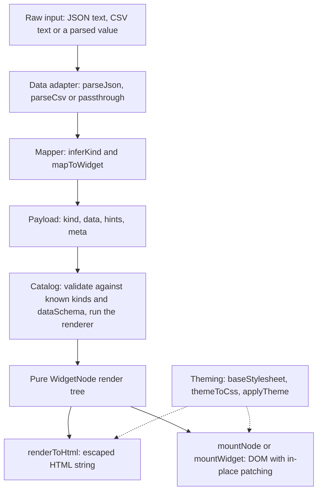

widgentic renders in stages, and every stage is a pure function over plain data until the last one. That is what lets the same widget be serialized to HTML on a server, mounted in a browser, and patched in place when its data changes.

## Data adapters

`@widgentic/core/adapters` turns boundary input into a `data` body without exceptions. `parseJson(input)` accepts a JSON string or an already parsed value (passed through by reference) and returns `{ ok: true, value }` or `{ ok: false, error }` with `code: "INVALID_JSON"` and the parse position when the engine reports one. `parseCsv(text, options?)` reads the header row into record keys, preserves quoted commas, and keeps every value a string unless you opt into `inferTypes: true`, which coerces numeric and boolean strings. Both are synchronous and pure.

## The mapper

`@widgentic/core/mapper` picks a default kind from the shape of the data when a producer does not name one: a non-empty array of plain objects becomes `table`, nodes carrying a `children` array become `tree`, and plain objects, primitives and everything ambiguous become `card`. `inferKind(data)` returns the kind; `mapToWidget({ data, hints?, meta?, kind? })` returns a complete payload. An explicit `kind` is never re-inferred, and the mapper is total: it never throws and never returns an error.

## The catalog

`createCatalog()` from `@widgentic/core/catalog` returns an independent registry pre-loaded with the built-ins — `card`, `table`, `tree` and `group` — each with a descriptor (`description`, `dataShape`, `dataExample`, supported `hints`, optional `dataSchema` and `styles`). Two kinds of extension join them:

- **Code renderers**, for trusted developers: `catalog.register(kind, renderer, descriptor?)`, where the renderer is a pure function from payload to render tree.
- **Templates**, for untrusted authors: `registerTemplate(catalog, kind, template, descriptor?)` validates a JSON template (text, `bind`, elements, `each`, `when`) and compiles it into an ordinary renderer. Interpretation is bounded by a node budget, and templates cannot carry event handlers, active-content tags or unsafe URL schemes. See [Template DSL](/design/template-dsl) and the generated [bounds](/reference/template-dsl).

Registering an existing kind — a built-in included — throws `DuplicateKindError`, so nothing can shadow `table`.

`catalog.render(payload)` validates the payload with the catalog's current kinds as `knownKinds`, validates `data` against the kind's `dataSchema` when it has one, then runs the renderer. It returns `{ ok: true, node }` or `{ ok: false, error }` and never throws; a custom renderer that throws surfaces as `RENDER_FAILED`. `group` renders each of its `data.items` through the same entry, so built-ins, code kinds and templates compose freely — groups do not nest, item errors carry `data.items[i]` paths, and the item count is capped.

## The render tree

A renderer returns a `WidgetNode`: either a string or a plain object `{ tag, attrs?, children? }`. There are no DOM types, no framework objects and no way to emit raw HTML, so the tree is JSON-serializable and can travel over the wire — the MCP server ships it to the app template as `structuredContent.tree`. Built-in renderers emit stable `wg-*` classes and are total: `null` data for a table yields a fallback tree, not an exception.

## Output layers

Two layers turn the tree into something visible:

- `renderToHtml(node)` serializes to a string, escaping `&`, `<`, `>`, `"` and `'` in every text and attribute value. This is what the server puts in the HTML text block and the `page` document.
- `mountNode(node, container)` materializes the tree through `container.ownerDocument`, sets text with `textContent`, and replaces the container's previous children on every call.

For living widgets, `mountWidget(payload, container, { catalog?, onAction? })` from `@widgentic/core/reactive` returns a handle with `initial`, `update(payload)`, `node()` and `dispose()`. `update` re-renders through the catalog, diffs the new tree against the previous one and patches minimally: text nodes change in place, only affected attributes are set or removed, and same-shape elements keep their DOM identity — an appended record adds one row while the existing rows stay the same nodes. A changed tag replaces only that subtree. A failed update (invalid payload, unknown kind) returns `{ ok: false, error }` and leaves the DOM and the retained tree untouched, so the next valid update patches from the last good state. The app template's bridge applies the same identity-preserving patching when successive tool results arrive.

<Tip>
`onAction` is how a host learns that someone activated a bound element. The mount never executes an action itself; without the callback, action elements are inert.
</Tip>

## Theming

Styling is separate from rendering. `baseStylesheet` (`@widgentic/core/theming`) opens with a `:root` block defining all 32 `--wg-*` tokens with their light defaults, then styles the `wg-*` classes using only `var(--wg-token, fallback)` references. Every token is consumed somewhere in the sheet; a token nothing reads is not added. `injectBaseStyles(document)` adds the sheet once per document.

A theme is a validated JSON map of token names to strings, plus optional `x-*` custom variables. `applyTheme(container, theme)` sets `--wg-*` inline properties on that container through the CSSOM with replace semantics — a second application removes what the first set — so two containers can carry different themes at once. `themeToCss(theme, selector)` emits the same declarations as a stylesheet rule, which is how the server themes a `page` document and fills the `css` field of `structuredContent`. Values that could escape a declaration or fetch a resource (`;`, braces, angle brackets, `url(`, `expression(`) fail validation with `INVALID_TOKEN_VALUE`. A named-theme registry ships `light` and `dark` and resolves `extends` at registration time. The token list is in [Theme tokens](/reference/theme-tokens); the authoring view is in [Themes](/design/themes).
