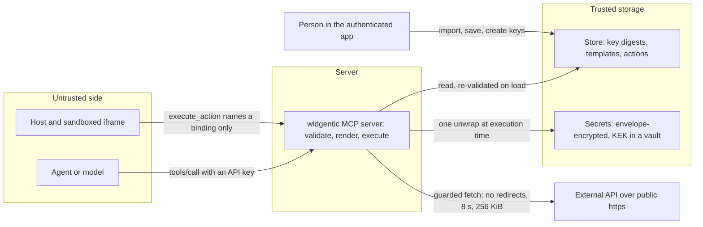

widgentic assumes the agent is fallible, the host is prompt-injectable, stored templates come from strangers, and any URL an action targets may be hostile. Every decision that matters therefore happens on the server, in an authenticated session, or in a validator.

## Who can write

- **There is no agent write path.** No MCP tool registers a widget, theme, schema, action or secret. Agents learn the contract through `get_authoring_guide`, `list_widgets`, `list_schemas`, `list_actions` and `list_theme_tokens` and draft import JSON; a person imports, validates and saves it in an authenticated session in the designer at [widgentic.dev/app](https://widgentic.dev/app). See [Authoring with an agent](/design/authoring-with-an-agent).
- **API keys are read-only by default** because they travel into third-party hosts and prompt-injectable contexts. The `write` scope can never be granted to a key.
- **`execute` is an opt-in scope fixed at key creation.** A read-only key still renders widgets that carry http actions, but their descriptors are marked `disabled: "scope"` and no `load` descriptor is emitted; `execute_action` answers `FORBIDDEN_SCOPE`. See [Keys and scopes](/get-started/keys-and-scopes).

## Templates are data

- A template has no expressions. Data **selects** — `bind` emits a value as text, `map` picks an author-written literal, `prefix` composes an author-written prefix with a value — and the author supplies every literal. Bindings only ever produce text and attribute strings, never markup.
- Tags on the denylist fail validation with `FORBIDDEN_TAG` and render as nothing if validation was bypassed: `script`, `iframe`, `frame`, `frameset`, `object`, `embed`, `style`, `link`, `meta`, `base`, `template`, `noscript`.
- `on*` and `srcdoc` attributes are rejected (`FORBIDDEN_ATTRIBUTE`) and skipped at render time; so are hand-written `data-wg-*` attributes — only a validated `action` binding produces a descriptor.
- URL-bearing attributes (`href`, `src`, `action`, `formaction`, `xlink:href`, `data`, `poster`, `ping`) keep only `http`, `https`, `mailto`, `tel` or relative references. `data:` is accepted solely for base64 `data:image/*` on an `img` `src`. A `prefix`-composed value faces the same guard.
- Interpretation is bounded by a deterministic node budget (every `each` iteration costs at least one unit) and a maximum nesting depth, so a stored template driven by a large payload cannot spend the process. The values are on [Template DSL](/reference/template-dsl).
- Custom `styles` and theme values cannot escape a declaration or fetch a resource: no braces, semicolons, angle brackets, `url(` or `expression(`, and style selectors must target `.wg-` classes.

## Actions execute on the server

- An `http` action runs server-side through a guarded fetch: public `https` only; targets that resolve to private, loopback, link-local or metadata addresses are refused before any bytes are read, with the connection pinned to the validated address; redirects are failures; an 8-second **total** deadline covers connection, headers and body; responses are capped at 256 KiB and must be `application/json` (or `application/*+json`) that parses and satisfies the declared output schema.
- Arguments are accepted only for fields the input schema declares (`INVALID_ACTION_INPUT` otherwise) and may not share a name with a fixed `query` parameter; the author's fixed `headers` and `query` are applied after the arguments, so they always win.
- **Bindings resolve from the store, never from the request.** `execute_action` names a widget kind and a binding identifier; the definition — URL, method, headers, schemas — comes from the caller's composed catalog. A `url` or `headers` field on the request is ignored.
- `prompt` actions never reach the server. The text is resolved at render time and the frame sends it as `ui/message`; the host prefills the composer and the person decides to send.
- **The iframe never touches the network.** The app template has no external references and declares no CSP domains; it talks only to the host, and http actions travel host to server to target. Executions are rate-limited per principal (60 per minute by default) and request bodies are capped at 4 MiB.
- After a successful http action the widget posts its new payload to the model's context (capped at 8 KiB per part), so the model and the visual never disagree.

## Secrets

- **Referenced by name only** — `{ "secret": "weather-token" }` in a header or query value, never in the URL, body or input mapping — and resolved from the executing principal's own secrets at execution time. A missing one fails with `UNKNOWN_SECRET` before any network activity.
- **Never displayed.** Listing returns `name`, `createdAt` and `updatedAt`; the authoring surfaces never show a value or preview after entry; a secret referenced by an action cannot be deleted (`SECRET_IN_USE`).
- **Always redacted.** Every string emitted about an execution — errors, diagnostics, tool text, log lines — has each resolved value replaced by `***`, including percent-encoded and JSON-escaped forms and object keys; store and vault error text is replaced by a fixed message before it leaves the server.
- **Envelope encryption.** Each write generates a fresh random 256-bit data key, encrypts the value with AES-256-GCM, wraps the data key with the deployment's key-encryption key through a cipher port, and persists only `{ alg, kekVersion, wrappedKey, iv, ciphertext, tag }` plus the name and timestamps. Two writes of one value produce different ciphertext. In production the KEK is a vault key that never leaves the vault (`@widgentic/mcp/secrets/keyvault`); the executing app performs one unwrap per resolution, and records can be re-wrapped under a new KEK version without decrypting the value. A store without a cipher refuses to store or return secrets at all.

The authoring view is in [Actions and secrets](/design/actions-and-secrets); the definition grammar is in [Action definition](/reference/action-definition).
